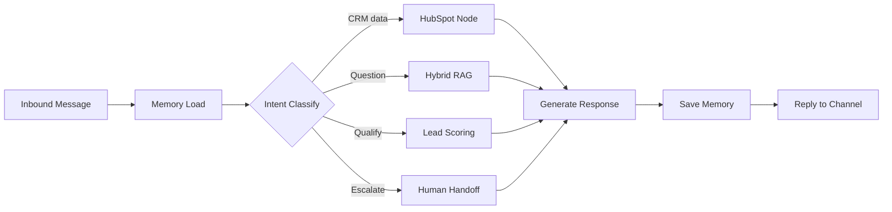

# ORCAST — CRM Agent (Response & Delivery Pipeline)

> **Portfolio case study.** This project started as a 5-person capstone (NTI HireReady) and is now being developed into an early-stage startup by the team. This repo shows my specific contribution and engineering approach — the production source, the real-estate ad-automation module, and the product roadmap stay private while the team works toward a public launch.

## What ORCAST is

ORCAST is a 24/7 AI sales agent that runs across Facebook Messenger, Facebook Page comments, and inbound voice calls (via Vapi). It classifies what a customer wants, answers product questions from a knowledge base, scores and qualifies leads, and escalates to a human teammate with full context when it should.

It's one of three modules in a larger platform; a teammate led the ad-campaign automation module, another led data analytics, and I worked with one other teammate on this CRM module.

## My role

I owned the **second half** of the CRM agent's LangGraph pipeline — everything from a classified intent through to a delivered reply:

| Area | What I built |
|---|---|
| **CRM integration** | Deduplicated HubSpot contact create/update via REST v3 |
| **Lead scoring** | Deterministic 4-factor formula (budget, authority, engagement, interest) → 0–100 score, with automatic escalation above 80 |
| **Hybrid retrieval (RAG)** | Dense search (Gemini embeddings + pgvector HNSW) fused with sparse full-text search (Postgres GIN) via Reciprocal Rank Fusion, then reranked with Gemini |
| **Human handoff** | HubSpot context notes + an escalation lock, so the agent never talks over a human once a thread is escalated |
| **Response generation** | A Gemini tool-call loop bounded to 6 iterations — keeps tool use deterministic and auditable instead of open-ended |
| **Memory** | Rolling summarization so conversation context stays bounded no matter how long a thread runs |
| **Multi-channel delivery** | Per-channel reply formatting with retry logic on transient failures |

## Architecture (high level)



*(This is the safe, high-level version of the flow — the full internal graph has more nodes and routing logic than shown here.)*

## Tech stack

`LangGraph` · `Google Gemini` · `FastAPI` · `asyncpg` · `PostgreSQL + pgvector` · `HubSpot REST API`

## A taste of the logic

The scoring node has no LLM in the loop on purpose — it's a plain formula so every escalation is explainable:

```python
def lead_score(budget: int, authority: int, engagement: int, interest: int) -> int:
    """0-100 score. >=80 triggers automatic handoff to a human."""
    return round(budget * 0.35 + authority * 0.30 + engagement * 0.20 + interest * 0.15)
```

## Why it's built this way

Three decisions mattered most:

- **Deterministic routing over free-form agent choice.** Every action maps to an explicit graph node. That makes the system auditable — you can point to exactly why a lead was escalated or why a reply says what it says.
- **Structured output everywhere.** Intent classification and other LLM calls are constrained to strict schemas instead of parsed from free text, so a malformed response can't silently break routing.
- **Built async, end to end.** FastAPI + asyncpg + httpx, so the agent isn't blocked waiting on one slow I/O call while other conversations are active.

## Links

- 🔗 **Live interactive overview:** [kareem-adel00.github.io/orcast-crm-agent](https://kareem-adel00.github.io/orcast-crm-agent/)
- 💼 [LinkedIn](https://www.linkedin.com/in/kareem-al-lboudy95/) · ✉️ azkareem1111@gmail.com

Happy to walk through implementation details in an interview or a conversation.
